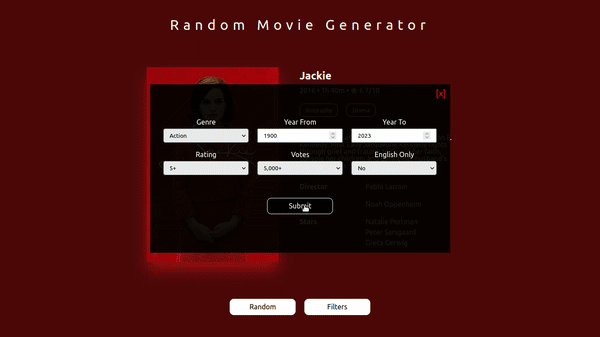

# Random Movie Generator



## Table of Contents

- [Description](#description)
- [Usage](#usage)
- [Installation](#installation)

## Description

The Random Movie Generator is a web-based application that allows users to discover random movies based on various criteria such as genre, release year, rating, and more. It provides a quick and fun way to find and learn about different movies you might not have encountered otherwise.

## Usage

1. Visit the Random Movie Generator website.
2. Click the "Random" button to generate a random movie suggestion.
3. Explore the movie's details, including its title, release year, duration, rating, and a brief summary.
4. Check out the movie's genres and the names of its director, writer, and stars.
5. If you want to discover another random movie, simply click the "Random" button again.

Enjoy exploring a world of cinema, one random movie at a time!

## Installation

The Random Movie Generator is a web-based application, so there's no need for installation. You can access it directly through your web browser.

If you want to run the project locally or modify it, you can clone the repository:

```bash
git clone https://github.com/khaled-ashraf-dev/random_movie_generator
